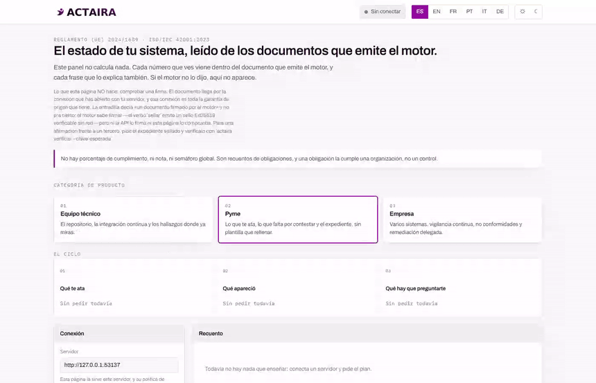
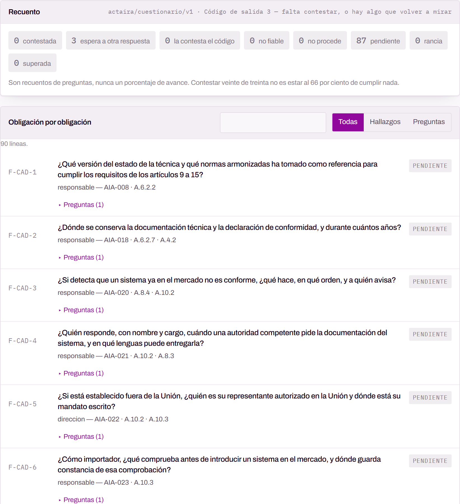
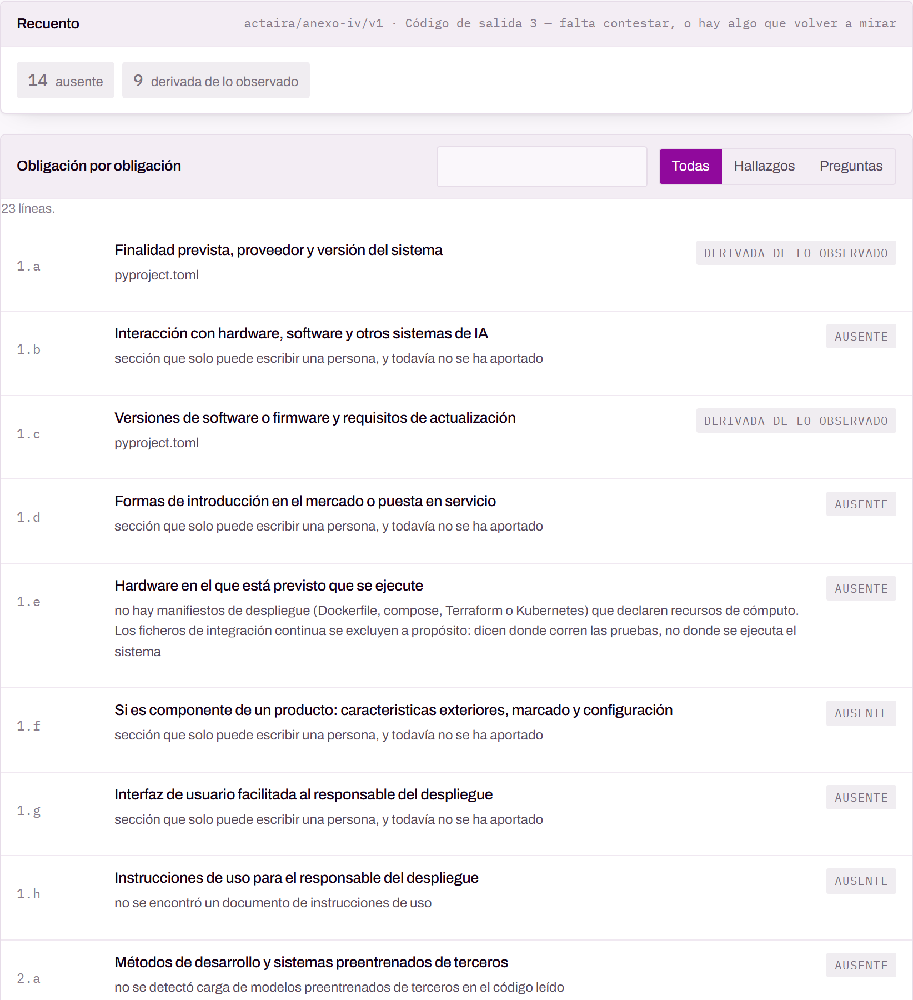
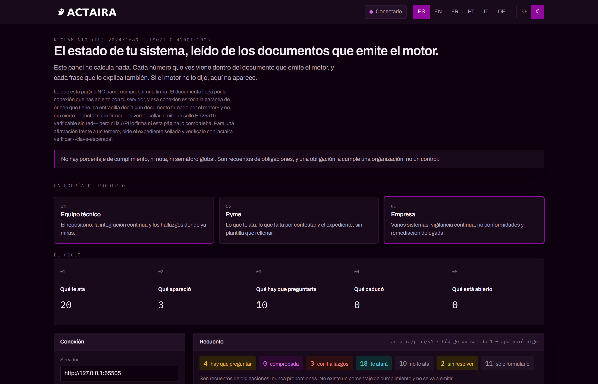

<div align="center">

# Actaira

**El Reglamento (UE) 2024/1689 y la ISO/IEC 42001, comprobados leyendo tu repositorio.**

Con procedencia por afirmación, y sin inventarse un porcentaje.

[](https://github.com/marcosmatalab/actaira-sys/actions/workflows/ci.yml)
[](docs/CAMBIOS.md)
[](LICENSE)
[](motor/tests)
[](herramientas/todo.py)



<sub>Treinta segundos contra la API de verdad y el repositorio de ejemplo. Nada
de esto está montado: se graba con un comando, y el mismo comando es la puerta
que comprueba que la pantalla funciona.</sub>

**[Manual de uso completo](docs/MANUAL.md)** · **[English](README.en.md)**

</div>

---

## El problema

Una consultora de cumplimiento te entrega un mapa de riesgos, una matriz de
controles y un cuestionario de trescientas preguntas. Todo eso describe lo que
tu organización **dice** que hace. Ninguna de esas tres cosas mira tu código.

El Reglamento no está escrito así. El artículo 12 pide que el sistema
**registre automáticamente** acontecimientos durante su ciclo de vida. El 14
pide que una persona **pueda intervenir** en el sistema. El 15 pide un nivel de
exactitud **mantenido**. Eso son propiedades de un programa, y un programa se
puede leer.

Actaira lee el repositorio, decide lo que se puede decidir leyendo bytes, y
dice en voz alta lo que no puede decidir.

## Las cuatro negativas

No son aspiraciones: son invariantes con puertas que las sujetan, y cada una
tiene su prueba.

| | |
|---|---|
| **Nunca un número** | No existe un «87 % de cumplimiento» y no se va a emitir. Se publican recuentos de obligaciones, nunca proporciones. |
| **Nunca juzgar, solo citar** | Ver `verify_signature` en el código es ver un patrón, no saber que hay una medida adoptada. La interpretación la firma una persona. |
| **Nunca inferir lo no observado** | Un `INDETERMINADO` sin motivo escrito es un `NO_CUMPLE` disfrazado. Si no se pudo mirar, se dice qué y por qué. |
| **Nunca actuar sobre lo observado** | Actaira dice qué hay que volver a mirar. Si eso bloquea un despliegue lo decides tú, en tu fichero de CI, donde la decisión se revisa. |

## Lo que hace, en cuatro comandos

```bash
pip install git+https://github.com/marcosmatalab/actaira-sys

actaira plan .    --rol proveedor --alto-riesgo si     # qué te ata y qué se comprobó
actaira preguntar . --rol proveedor --alto-riesgo si   # lo que hay que preguntarte, y lo que no
actaira anexo .   --rol proveedor --alto-riesgo si     # el Anexo IV, con procedencia por sección
actaira soa .     --rol proveedor --alto-riesgo si     # la declaración de aplicabilidad de la ISO 42001
```

> Se instala desde el repositorio y no desde PyPI porque **todavía no está
> publicado en PyPI**, y decir `pip install actaira-motor` sería mandarte a un
> 404 en la primera orden. Cuando se publique, esa será la línea y esta nota
> desaparece. Hay una puerta que lo comprueba: mientras
> `PUBLICADO_EN_PYPI` sea `False`, ningún documento puede decir lo contrario.

Necesita Python 3.12 o posterior. Nada de esto sube tu código a ningún sitio y
no hace falta cuenta: se puede correr con la red desconectada.

El **[manual de uso](docs/MANUAL.md)** lo explica entero: cada comando, cada
botón, cada estado y el arranque paso a paso.

## La plataforma

El motor es un ejecutable y con eso basta. Encima hay un servidor en Go que lo
sirve por HTTP, y un panel de <!--cifra:vistas_del_panel-->11<!--/cifra--> vistas
en <!--cifra:idiomas-->6<!--/cifra--> idiomas que **no calcula nada**: cada
número que enseña viene dentro del documento que emitió el motor, y cada frase
que lo explica también.


Arriba, la categoría de producto y el ciclo. No cambian lo que el motor dice:
cambian qué le pides y qué ves primero, que es lo único que una categoría
comercial tiene derecho a cambiar.

<table>
<tr>
<td width="50%"></td>
<td width="50%"></td>
</tr>
<tr>
<td><b>El plan.</b> Obligación por obligación: qué te ata, qué se comprobó
leyendo bytes, dónde está el hallazgo y qué hacer con él.</td>
<td><b>El cuestionario.</b> Cada pregunta declara a qué sirve con
identificadores de los <b>tres</b> catálogos a la vez. Una respuesta cierra el
artículo 16, el 17, la cláusula 5.3 y el control A.3.2.</td>
</tr>
<tr>
<td></td>
<td></td>
</tr>
<tr>
<td><b>La declaración de aplicabilidad.</b> Los
<!--cifra:controles_iso-->38<!--/cifra--> controles del Anexo A, cada uno con
su justificación.</td>
<td><b>El expediente técnico.</b> El Anexo IV sección por sección, y cada
sección dice de dónde salió <i>o por qué falta</i>.</td>
</tr>
</table>

En oscuro también, porque es la mitad de las capturas que alguien mira y la que
suele estar rota:



### El idioma de la pantalla y el del documento

La plataforma habla **castellano, inglés, francés, portugués, italiano y
alemán**. El motor emite el contenido normativo en **dos**: castellano e
inglés. No es una limitación que se vaya a arreglar traduciendo más — es que
los títulos de obligación, los motivos y las remediaciones los escribe una
persona, y traducirlos a máquina es exactamente lo que prohíbe la segunda
negativa de esta casa.

Así que no hay dos ajustes. **Hay uno, y el otro se deriva de él**:

| la pantalla en | el documento llega en |
|---|---|
| castellano | castellano |
| cualquier otro de los seis | inglés, y la pantalla lo dice, en ese idioma |

No existe ningún sitio donde elegir el idioma del documento por separado, y hay
una puerta que lo comprueba mirando la cabecera `Accept-Language` que el panel
manda de verdad: seis idiomas de interfaz, un solo mando, y la regla de arriba.

## Los números

Ninguno está escrito a mano. Salen del catálogo y del árbol, los rellena
`herramientas/generar_docs.py` y la puerta falla si alguno se queda viejo.

| | |
|---|---|
| Obligaciones del Reglamento | <!--cifra:obligaciones-->48<!--/cifra--> (<!--cifra:obligaciones_maquina-->13<!--/cifra--> comprobables leyendo bytes, <!--cifra:obligaciones_organizativa-->27<!--/cifra--> organizativas) |
| Requisitos de la ISO/IEC 42001 | <!--cifra:requisitos-->88<!--/cifra--> sobre <!--cifra:clausulas-->32<!--/cifra--> cláusulas |
| Controles del Anexo A | <!--cifra:controles_iso-->38<!--/cifra--> |
| Pares del cruce entre marcos | <!--cifra:pares-->101<!--/cifra-->, con <!--cifra:pares_rotos-->0<!--/cifra--> rotos y <!--cifra:huecos-->0<!--/cifra--> huecos de cobertura |
| Reglas que leen código | <!--cifra:reglas-->68<!--/cifra--> en <!--cifra:paquetes_de_reglas-->17<!--/cifra--> paquetes |
| Preguntas del banco | <!--cifra:preguntas-->90<!--/cifra-->, cada una atada a los tres catálogos |
| Pruebas | <!--cifra:pruebas-->563<!--/cifra--> de Python + <!--cifra:pruebas_go-->102<!--/cifra--> de Go |
| Fases de la puerta de aceptación | <!--cifra:fases_de_la_puerta-->26<!--/cifra--> |
| Defectos de las pasadas adversariales | <!--cifra:defectos_adversariales-->141<!--/cifra-->, cada uno con su nombre en `docs/BACKLOG.md` |

Y el número que **no** existe: no hay porcentaje de cumplimiento. Con un perfil
sin responder, <!--cifra:indeterminadas_perfil_vacio-->48<!--/cifra-->
obligaciones salen sin resolver y ninguna sale limpia. No hay camino de un
formulario vacío a un resultado verde.

## Lo que tarda

Medido contra la pila entera —servidor Go compilado, motor como proceso aparte,
el repositorio de ejemplo— con un comando que cualquiera puede repetir:

```bash
python herramientas/navegador.py --latencias
```

| | |
|---|---|
| Cargar el panel | **21 ms** hasta el DOM, **1 ms** de respuesta: un solo fichero de <!--cifra:panel_kb-->269<!--/cifra--> KB —tipografías incluidas— y **cero peticiones de red** |
| Transporte de un verbo (HTTP + JSON) | **~4 ms** de mediana; las 11 vistas suman menos de 100 ms |
| El análisis en sí | **9–28 ms**, según el verbo, sobre el repositorio de ejemplo |
| Arrancar el intérprete que lo corre | **440–1 750 ms** |

El último renglón es **entre el 94 y el 98 %** del tiempo, y no es un defecto:
**es la frontera**.
Cada verbo es un proceso aparte para que el motor que contesta por HTTP sea
exactamente el mismo binario que corre quien te audita en su máquina. El precio
de esa garantía es un arranque de Python por petición. Cargar el catálogo entero
—<!--cifra:obligaciones-->48<!--/cifra--> obligaciones,
<!--cifra:controles_iso-->38<!--/cifra--> controles,
<!--cifra:reglas-->68<!--/cifra--> reglas, 39 ficheros JSON— cuesta **4 ms**, así
que no hay nada que optimizar ahí: lo que se optimizaría es el intérprete.

Y por eso el servidor lleva topes de concurrencia por cliente y globales, con
`Retry-After` en el rechazo. Un verbo no es una petición barata: es un proceso
que lee el repositorio entero de alguien.

## Cómo se sostiene

```bash
make todo               # la puerta entera
make fase F=navegador   # una sola
```

Cada fase **afirma** algo concreto y se pone roja si no se cumple. Lo que no se
puede medir en una máquina se declara OMITIDO con su motivo, y en integración
continua se corre con `--sin-omitir`, donde una omisión es un rojo: si algo deja
de estar instalado, el resumen no puede seguir diciendo «0 en rojo».

- **La matriz.** La puerta corre en **Ubuntu y Windows × Python 3.12 y 3.13**.
  No es una comodidad. Con las pruebas corriendo solo en Windows, el conector de
  git estaba roto en todo POSIX y sus cinco pruebas salían verdes; con solo
  Linux, tres verbos reventaban con la página de códigos cp850 y el traceback
  salía con el código que significa «hay hallazgos». Cada defecto era invisible
  desde el otro sistema.
- **El detector de carreras.** Las pruebas de la plataforma corren bajo `-race`,
  con el motor instalado y el fixture apuntado, y **cero saltadas**: una prueba
  que se salta no es una prueba que pasa. Lo corre la matriz en Linux **y la
  puerta local**, en cuanto hay un compilador de C en el camino; si no lo hay,
  la fase lo dice en vez de callarse. Vivía solo en integración continua, así
  que en la práctica no se corría al escribir, y una carrera de datos real
  —dos métodos públicos del planificador escribiendo los mismos campos— pasó
  tres pasadas adversariales sin que nadie la viera.
- **El navegador.** Una fase abre **las dos pantallas** en Chromium. El panel,
  contra la API de verdad: pulsa las <!--cifra:vistas_del_panel-->11<!--/cifra-->
  vistas y comprueba que cada una pinta filas —o dice por qué no—, que los seis
  idiomas no escriben `undefined` y que la consola del navegador no suelta ni un
  error. Y la consola de aplicabilidad, que se abre sola desde el disco: que sus
  tres vistas se pulsan y que contestar una pregunta no te echa de donde estabas.
  Existe porque el panel no tenía **ni una sola prueba que ejecutara su
  JavaScript**: siete de las once vistas estuvieron inalcanzables sin que nada
  fallara, y un `ReferenceError` que rompía las once pasó cuatro auditorías
  seguidas. La consola se añadió después de que le pasara lo mismo por su cuenta:
  sus tres `<main>` compartían `id` con su botón de pestaña, así que conmutar de
  vista escondía las pestañas en vez de los paneles y **dos de sus tres vistas no
  se podían alcanzar nunca**, con sus veinte pruebas en verde. La lección se había
  aplicado al panel y no al artefacto de al lado.
- **Lo que se lee sin ejecutarlo.** Una fase corre `ruff` con las reglas que
  cazan defectos —nombres que no existen, imports muertos, variables que se
  calculan y se tiran, `except` que se tragan la causa— y tiene que salir
  limpia. `mypy` **no** sale limpio y no se finge que sí: su deuda está escrita
  error por error en `herramientas/mypy-conocidos.txt`, y la fase se pone roja
  en los dos sentidos —uno nuevo, y uno arreglado que se queda en la lista—,
  porque una lista larga de más deja de decir cuánta deuda hay.
- **El contrato.** <!--cifra:vistas_del_panel-->11<!--/cifra--> esquemas JSON
  publicados en `contrato/`, comprobados contra lo que el motor emite y contra
  los campos que el panel lee. Si el motor renombra un campo, la puerta lo dice
  en vez de que la pantalla se quede en blanco sin que falle nada.
- **Las pasadas adversariales.** Cada fase cierra con una antes de abrir la
  siguiente, y lo encontrado se escribe en `docs/BACKLOG.md` con su número y su
  lección. <!--cifra:defectos_adversariales-->141<!--/cifra--> hasta hoy. Los más
  caros no eran fallos: eran respuestas plausibles y falsas, que es lo peor que
  puede emitir una herramienta que va a un auditor.

Y una regla que sale de haberla necesitado dos veces: **una puerta nueva hay que
verla fallar** contra el código roto antes de creérsela. Escribirla no basta.
Una de ellas nació muerta porque un heredoc de bash convirtió el `\b` de su
expresión regular en un byte de retroceso, y pasó verde con el fallo delante.

## En tu integración continua

Copia [`integraciones/github/actaira.yml`](integraciones/github/actaira.yml) a
`.github/workflows/`. Los hallazgos salen en **SARIF**, o sea en la pestaña
Security y dentro de la revisión del pull request, con la remediación escrita
al lado. El hallazgo llega a quien puede arreglarlo, el día que escribió la
línea.

La puerta que bloquea el despliegue va **comentada** en la plantilla. Hay un
test que comprueba que sigue comentada.

### La vigilancia que no sondea

A una evidencia la supera **el digest del sujeto sobre el que se tomó**, no el
nombre de ese sujeto. Y el sujeto de un control son exactamente los ficheros
que ese control lee.

> Medido sobre el repositorio de ejemplo: añadir una línea a `datos/README.md`
> supera **uno** de los doce controles con evidencia y deja **once** intactos.
> El superado es el del artículo 10, que es el único que lee esa ficha de datos.

| alternativa | qué pasa |
|---|---|
| digest del repositorio entero | muro rojo en cada errata; se aprende a ignorar en dos semanas |
| el nombre del control | nada se supera nunca; la caducidad es un temporizador |

Consecuencia de coste: sondear N repositorios cada minuto son N × 1440
ejecuciones al día. Reaccionar a un empujón más un vencimiento son del orden de
las veces que commiteas, más una.

## Lo que NO hace

- No emite un porcentaje de cumplimiento. No existe.
- No dice que cumples. Dice qué se comprobó leyendo bytes, con qué regla, de
  qué versión y de qué autor, y qué queda fuera del alcance de esa comprobación.
- No cierra un control del Anexo A porque una comprobación del Reglamento salga
  limpia: la norma pide cosas que el Reglamento no pide, y el cruce lo dice.
- No firma por ti. La declaración UE de conformidad se emite con la palabra
  **BORRADOR** en el encabezado mientras no exista la firma del punto 8 del
  Anexo V, y no hay bandera que la quite por otra vía: los puntos 3 y 4 son
  afirmaciones del proveedor bajo su exclusiva responsabilidad.

## Cómo está hecho

```
catalogo/     el contenido normativo como DATOS, no como código, para que lo
              revise un jurista y no un programador
motor/        Python. Un motor genérico de controles; los artículos son JSON
plataforma/   Go. Sirve los verbos por HTTP, con papeles, topes por cliente y
              vigilancia continua. No decide nada: invoca el motor
panel/        se construye de tres piezas con `make panel`; una sola página que
              se abre sin servidor y no guarda la credencial en ninguna parte
sitio/        la portada, en los seis idiomas, con las cifras sacadas del árbol
consola/      se construye desde el motor con `make consola`, no se edita
contrato/     los esquemas JSON que el motor promete, comprobados en los dos lados
herramientas/ la puerta de aceptación, el navegador y los generadores
integraciones/ SARIF y la plantilla de CI
.github/      la puerta corrida en DOS sistemas
docs/         ARQUITECTURA.md (las decisiones y por qué), BACKLOG.md (los
              defectos de cada pasada adversarial, con su nombre) e imagenes/
```

### Cómo se hicieron estas imágenes

Con el mismo arnés que sujeta el panel, contra la pila de verdad. No hay ninguna
captura montada ni ningún dato inventado:

```bash
python herramientas/navegador.py --capturas    # las imágenes de este README y del manual
python herramientas/navegador.py --gif         # el recorrido de 30 s
python herramientas/navegador.py --puerta      # y lo que comprueba que funciona
```

**El GIF se regenera sólo cuando la pantalla cambia de verdad.** No es
tacañería: un vídeo grabado nunca sale igual dos veces, así que cada
regeneración mete un objeto nuevo en la historia de git y ninguno se va. Por eso
pesa 3 MB y no 8 —680 px, 5 fps, 64 colores; se sigue leyendo el titular, las
categorías y el ciclo, que es lo que un GIF de README tiene que enseñar— y por
eso el comando se pone rojo si pasa de 5 MB. Las capturas fijas no tienen ese
problema: un PNG de la misma pantalla sale casi idéntico y git lo reconoce.

## Licencia y alcance de los catálogos

Apache-2.0. Ver [LICENSE](LICENSE) y [NOTICE](NOTICE).

El texto de la ISO/IEC 42001:2023 **no se reproduce**: la norma es de pago. Los
catálogos listan identificadores, numeración y títulos, y añaden trabajo propio
—el nivel de comprobabilidad, el cruce entre marcos, las reglas y sus
remediaciones—. El Reglamento (UE) 2024/1689 es público y se cita por
referencia, nunca a granel.

Las reglas y las remediaciones las escribió una persona. Un modelo puede
proponer el borrador de una regla fuera de línea; nunca redacta reglas ni
remediaciones en ejecución.
