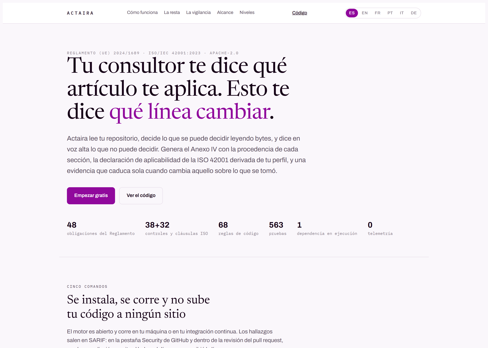

# Manual de uso de Actaira

**[English version](MANUAL.en.md)** · [Volver al README](../README.md)

Este manual explica el producto entero: qué hace cada comando, qué hace cada
botón y qué significa cada cosa que sale en pantalla. Está escrito para que
alguien que no ha visto Actaira nunca pueda empezar y llegar hasta el
expediente sin preguntarle nada a nadie.

Si sólo quieres probarlo, ve a [Empezar en cinco minutos](#empezar-en-cinco-minutos).

---

## Índice

1. [Qué es Actaira, en un párrafo](#qué-es-actaira-en-un-párrafo)
2. [Empezar en cinco minutos](#empezar-en-cinco-minutos)
3. [Los cuatro comandos](#los-cuatro-comandos)
4. [Los códigos de salida](#los-códigos-de-salida)
5. [Levantar la plataforma](#levantar-la-plataforma)
6. [El panel, pieza por pieza](#el-panel-pieza-por-pieza)
7. [Las once vistas, una por una](#las-once-vistas-una-por-una)
8. [Cómo se lee una fila](#cómo-se-lee-una-fila)
9. [Los idiomas](#los-idiomas)
10. [La portada](#la-portada)
11. [Ponerlo en tu integración continua](#ponerlo-en-tu-integración-continua)
12. [Preguntas que salen siempre](#preguntas-que-salen-siempre)

---

## Qué es Actaira, en un párrafo

Actaira lee tu repositorio y te dice qué te ata del **Reglamento (UE)
2024/1689** y de la **ISO/IEC 42001**, qué se puede comprobar leyendo tus bytes,
qué hay que preguntarte porque no está en el código, y qué expediente sale de
todo eso. No te da una nota, no te dice que cumples y no firma por ti. Dice qué
miró, con qué regla, y qué se quedó fuera.

---

## Empezar en cinco minutos

### 1. Instalar

```bash
pip install git+https://github.com/marcosmatalab/actaira-sys
```

Necesitas **Python 3.12 o posterior**. No hace falta cuenta, no hay registro y
nada de lo que hagas sale de tu máquina: puedes correrlo con la red
desconectada.

> Se instala desde el repositorio porque el paquete **todavía no está publicado
> en PyPI**. El día que se publique, la orden será `pip install actaira-motor` y
> esta nota desaparecerá.

### 2. Preguntarle qué te ata

Empieza por aquí, porque **no lee ni un byte de tu código**: la respuesta sale
sólo de lo que declares sobre ti.

```bash
actaira aplicabilidad --rol proveedor --alto-riesgo si --via-anexo anexo_iii
```

### 3. Pasarlo por tu repositorio

```bash
cd /ruta/a/tu/repositorio
actaira plan . --rol proveedor --alto-riesgo si
```

Eso te devuelve, obligación por obligación, qué se comprobó leyendo bytes, qué
apareció, dónde está y qué hacer con ello.

### 4. Ver lo que falta por contestar

```bash
actaira preguntar . --rol proveedor --alto-riesgo si
```

Lo que el código no puede contestar, te lo pregunta. Y cada pregunta dice a qué
artículo, a qué cláusula y a qué control sirve.

### 5. Sacar el expediente

```bash
actaira anexo . --rol proveedor --alto-riesgo si   # el Anexo IV
actaira soa .   --rol proveedor --alto-riesgo si   # la declaración de aplicabilidad
```

Con eso ya has recorrido el producto entero por línea de comandos. Lo que sigue
—la plataforma y el panel— es lo mismo con pantalla, para varias personas y
varios sistemas.

---

## Los cuatro comandos

Todos aceptan `--json` para sacar el documento en crudo, y `--idioma es|en`.

| comando | qué hace | ¿lee tu código? |
|---|---|---|
| `actaira aplicabilidad` | Qué te ata y qué no, a partir de tu perfil | No |
| `actaira plan <ruta>` | Obligación por obligación, con hallazgos y remediación | Sí |
| `actaira preguntar <ruta>` | Lo que hay que preguntarte, y lo que ya no hace falta | Sí |
| `actaira comprobar <ruta>` | Sólo el control del artículo 50, a solas | Sí |
| `actaira soa <ruta>` | La declaración de aplicabilidad de la ISO 42001 | Sí |
| `actaira anexo <ruta> --cual iv` | El expediente técnico del Anexo IV | Sí |
| `actaira vigilar <ruta> --registrar` | Observa y guarda la evidencia sellada | Sí |
| `actaira vigilar --solo-almacen` | Qué caducó, sin tocar el repositorio | No |
| `actaira almacen verificar` | Si la cadena de evidencia es la que escribió esta casa | No |
| `actaira noconformidad listar` | Lo que está abierto | No |
| `actaira revision` | La revisión por la dirección, con lo que la apoya | No |

### El perfil

Casi todos aceptan las mismas banderas para decir **quién eres respecto al
sistema**. Puedes declarar **varios roles**: una organización suele ser
proveedor de un sistema y responsable del despliegue de otro.

| `--rol` | artículo | qué significa |
|---|---|---|
| `proveedor` | 3.3 | desarrollas el sistema, o lo mandas desarrollar, y lo pones en el mercado con tu nombre |
| `responsable_despliegue` | 3.4 | lo usas bajo tu autoridad |
| `representante_autorizado` | 3.5 | representas en la Unión a un proveedor de fuera |
| `importador` | 3.6 | lo introduces en el mercado viniendo de fuera de la Unión |
| `distribuidor` | 3.7 | lo comercializas sin ser ninguno de los anteriores |
| `fabricante_producto` | 25.3 | lo incorporas a un producto tuyo regulado |
| `proveedor_modelo` | 53 | provees un modelo de uso general |

Y el resto del perfil:

- `--alto-riesgo si|no` — si el sistema es de alto riesgo.
- `--via-anexo anexo_iii|anexo_i` — **por dónde** lo es. Decide la fecha que te
  aplica: 2 de diciembre de 2027 (Anexo III, sistema autónomo del art. 6.2) o
  2 de agosto de 2028 (Anexo I, componente de seguridad de un producto
  regulado, art. 6.1).
- `--sector-publico si|no`, `--modelo-uso-general si|no`,
  `--riesgo-sistemico si|no`.
- `--fecha AAAA-MM-DD` — la fecha de evaluación.

> **Dejar algo sin responder no es un truco para salir limpio.** Con el perfil
> vacío ninguna obligación sale resuelta: salen todas sin resolver, y cada una
> dice qué falta por contestar. No existe camino de un formulario en blanco a un
> resultado verde.

---

## Los códigos de salida

Esto importa si lo metes en un script: **un hallazgo no es un error**. Una
herramienta de cumplimiento que encuentra algo ha hecho su trabajo.

| código | significa | ¿es un fallo? |
|---|---|---|
| `0` | Se miró y no quedó nada pendiente | No |
| `1` | Apareció algo | **No** — es trabajo, no avería |
| `3` | Falta contestar, o hay algo que volver a mirar | **No** |
| `4` | El analizador se rompió | Sí |
| `5` | El almacén no es el que escribió esta casa | Sí |

Si tratas el `1` como error, tu puerta se pondrá roja justo cuando el producto
funciona, y la salida natural de eso es bajar el listón hasta que no mire nada.

---

## Levantar la plataforma

El motor por sí solo ya sirve. La plataforma añade HTTP, varios clientes,
papeles y vigilancia continua.

### El espacio de clientes

```
clientes/
  acme/
    trabajo/           <- una copia del repositorio del cliente
    evidencia.jsonl    <- lo escribe la plataforma al vigilar
    respuestas.json    <- las respuestas del formulario, si las hay
```

### Las credenciales

Un fichero JSON que mapea `token → cliente`, **en permisos 0600**:

```json
{ "un-token-largo-y-aleatorio": "acme" }
```

### Arrancar

```bash
actaira-api \
  --clientes ./clientes \
  --credenciales ./cred.json \
  --motor actaira \
  --escucha 127.0.0.1:8787
```

Sin fichero de credenciales **no arranca**, y sin raíz de clientes tampoco: no
hay configuración por omisión que valga para producción, y es a propósito. Por
omisión escucha sólo en local; exponerlo a la red es una decisión, no un
descuido.

Otras banderas que conviene conocer:

| bandera | para qué |
|---|---|
| `--revisar-cada 1h` | cada cuánto revisa qué caducó sin que nadie empuje nada. `0` lo apaga, y apagarlo se dice en voz alta al arrancar |
| `--bitacora fichero.jsonl` | anota cada pasada de vigilancia y cada intento de entrega, **también las pasadas sin avisos** |
| `--emisor emisor.json` | usa un proveedor de identidad real (OIDC): el cliente y los papeles salen del testigo firmado |
| `--tope-global 4` / `--tope-por-cliente 2` | cuántos verbos del motor pueden correr a la vez. Cada uno es un **proceso** que lee un repositorio entero |
| `--plazo 3m` | lo que puede tardar un verbo antes de cortarlo |

### Los papeles

Si usas OIDC, cada credencial lleva papeles y cada verbo pide uno:

| papel | qué puede hacer |
|---|---|
| `lectura` | leer lo ya observado: aplicabilidad, cuestionario, SoA, anexo, evidencia, no conformidades, revisión |
| `observacion` | además, arrancar el motor sobre el repositorio: plan, vigilar, comprobar |
| `remediacion` | además, mover trabajo y recibir eventos: empujón, remediar |
| `admin` | todo |

### El panel

El servidor **sirve el panel desde su propio origen**, así que basta con abrir
la dirección donde escucha:

```
http://127.0.0.1:8787/
```

Eso no es comodidad: la política de seguridad de contenido lleva
`connect-src 'self'`, que es lo que impide que un script colado en la página se
mande el expediente de un cliente a otro sitio.

---

## El panel, pieza por pieza

Esta es la pantalla entera, con el perfil relleno y el plan pedido:


**El panel no calcula nada.** Cada número que ves viene dentro del documento que
emitió el motor, y cada frase que lo explica también. Si el motor no lo dijo,
aquí no aparece.

### 1. La cabecera


De izquierda a derecha:

- **El logo.**
- **El indicador de conexión.** Dice si estás conectado; al pulsarlo te lleva al
  campo del servidor.
- **El idioma de la interfaz.** Seis: ES, EN, FR, PT, IT, DE.
- **El tema.** ☼ claro y ☾ oscuro. Vuelve a pulsar el que está activo para
  seguir al del sistema.

### 2. La categoría de producto


Las tres cambian **qué le pides al motor y qué ves primero**. No cambian lo que
el motor dice: ninguna categoría oculta un hallazgo ni cambia un veredicto.

| categoría | para quién | qué enseña |
|---|---|---|
| **Equipo técnico** | quien escribe el código | el plan, el artículo 50, la evidencia y las no conformidades |
| **Pyme** | quien responde de cumplir | qué te ata, el plan, el cuestionario, la SoA, el expediente y qué caducó |
| **Empresa** | quien gobierna varios sistemas | las once |

### 3. El ciclo


Cinco recuentos que se llenan a medida que pides cosas: **qué te ata**, **qué
apareció**, **qué hay que preguntarte**, **qué caducó** y **qué está abierto**.
Lo que todavía no has pedido pone *Sin pedir todavía* — que no es lo mismo que
cero.

### 4. Conexión


- **Servidor.** Se rellena solo con el origen de la página cuando la sirve un
  servidor. Si abres el panel como fichero local, escríbelo a mano.
- **Cliente.** El identificador del espacio: la carpeta bajo `clientes/`.
- **Credencial.** El token.

Pulsa **Conectar**. El panel prueba primero `/salud` y después una ruta que
**sí** pide credencial: decir «conectado» porque el servidor respira sería
prometer algo que no se ha comprobado.

Una vez conectado, el indicador de la cabecera se enciende y aparece
**Desconectar**, que borra la credencial de memoria y vacía todo lo pedido:


> **La credencial no se guarda.** Ni en `localStorage`, ni en `sessionStorage`,
> ni en una cookie. Vive en una variable y se pierde al recargar. Es incómodo a
> propósito: un token en el almacenamiento del navegador lo lee cualquier script
> que acabe en la página, y ese token vale para leer el expediente entero de un
> cliente.

### 5. Tu perfil


Los mismos campos que las banderas de la línea de comandos. **Roles admite
varios**: marca con Ctrl o Cmd.

Las tres opciones de cada desplegable son **Sin responder / Sí / No**, y «sin
responder» es un estado de verdad, no un vacío: las obligaciones que dependen de
esa respuesta salen sin resolver y lo dicen.

### 6. Qué quieres ver


Los once botones. Los que no pertenecen a la categoría elegida se ocultan. Todos
se desactivan mientras el motor corre y se vuelven a activar al terminar.

### 7. Recuento


Las pastillas son **recuentos de obligaciones**, nunca proporciones. A la
derecha, el **sello**: el esquema del documento y el código de salida con el que
el motor contestó.

> Aquí no hay ni habrá un porcentaje de cumplimiento. Un 87 % no significa nada:
> una obligación la cumple una organización, no un control.

### 8. Obligación por obligación


- **El buscador** filtra por texto y dice cuántas quedan.
- **Todas / Hallazgos / Preguntas** filtra por lo que cada línea trae dentro.


Si no hay nada que enseñar, la pantalla distingue dos cosas que no son la misma:
*«este documento no trae ninguna línea»* y *«ninguna línea encaja con este
filtro»*.

### 9. El documento tal cual


Lo que devolvió el motor, sin tocar. Está ahí para que puedas comprobar la
pantalla contra su fuente: **si algo de lo que ves arriba no está aquí dentro,
es un defecto del panel**.

---

## Las once vistas, una por una

### Qué me ata — `aplicabilidad`


La primera pregunta del producto. **No lee ni un byte de tu código**: sale sólo
del perfil, así que es instantánea y puedes jugar con las respuestas para ver
qué cambia.

### Pedir el plan — `plan`


El grueso. Obligación por obligación: qué te ata, qué se comprobó leyendo bytes,
qué apareció, dónde y con qué regla, y qué hacer.

### Artículo 50 — `comprobar`


El control de transparencia del artículo 50, a solas. **No lleva perfil**: lee
el código y dice lo que ve. Enseña qué ficheros miró, que es la mitad de la
promesa del producto.

### Qué falta contestar — `preguntar`


El cuestionario que sobra. Cada pregunta declara a qué sirve con identificadores
de **los tres catálogos a la vez** —artículo del Reglamento, cláusula de la
norma y control del Anexo A—, así que una respuesta cierra varias cosas.

Y una pregunta **desaparece** en cuanto un control lee los bytes que la
contestan. La resta se publica con la lista de controles que la produjeron: un
número sin la lista detrás es publicidad.

### Declaración de aplicabilidad — `soa`


Los controles del Anexo A de la ISO/IEC 42001, cada uno con si está incluido y
con su justificación.

### Expediente técnico — `anexo`


El Anexo IV sección por sección. Cada sección dice **de dónde salió**, y las que
faltan dicen **por qué faltan**.

### Pedir la vigilancia — `vigilar`


Observa el repositorio y **guarda la evidencia sellada**. Lo que ya estaba y
sigue igual no se reescribe: se **revalida**, que mueve el reloj de la frescura
sin inflar el fichero.

### Evidencia — `almacen`


El estado de la cadena de evidencia, que es la única afirmación que este
producto hace frente a un tercero:

- **Fichero** — si existe. Que no exista **no es un fallo**: un cliente que no ha
  observado nada todavía no tiene almacén.
- **Cadena** — si los sellos cuadran de principio a fin.
- **Cabeza** — el sello de la última línea. Anótala fuera: es lo único que
  detecta que alguien reescriba el fichero entero y lo vuelva a sellar.
- **Cabeza esperada** — sale *indeterminada* si nadie dijo qué esperaba. Eso
  **no es lo mismo** que que cuadre.
- Los recuentos de observaciones selladas y de líneas sin cadena demostrable.

### Qué caducó — `vencimientos`


Qué hay que volver a mirar, **sin tocar tu repositorio**: para saber qué caducó
hacen falta el almacén y un reloj, no tu código. Es la ruta que puede correr un
cron.

A una evidencia la supera el **digest del sujeto** sobre el que se tomó, no el
nombre de ese sujeto. Tocar un README no supera la evidencia de un control que
no lee ese README.

### No conformidades — `noconformidad`


Lo que está abierto, con cuántos días lleva, si está vencida, si está estancada
y si hay incoherencias.

> **EJECUTADA no es cerrada.** La cláusula 10.2 pide revisar si la acción
> funcionó, y eso es una observación posterior.

### Revisión por la dirección — `revision`


Las entradas que la cláusula 9.3 pide, cada una con las cláusulas que cubre y
con lo que la apoya.

---

## Cómo se lee una fila


Cada línea tiene cuatro partes:

1. **A la izquierda**, la clave: el artículo, el identificador de la obligación
   o el del control.
2. **En el centro**, el título y, debajo, el motivo —por qué está en ese estado.
3. **Desplegables**: *Remediación* (qué hacer, dónde está y con qué regla se
   encontró) y *Preguntas* (lo que hay que contestar).
4. **A la derecha**, la insignia con el estado.

Los estados salen **dentro del documento**, no de esta página: el vocabulario es
del motor. Los que más vas a ver:

| insignia | qué significa |
|---|---|
| **te atará** | te ata, pero todavía no ha llegado su fecha |
| **comprobada** | se leyeron los bytes y responden a lo que la obligación pide |
| **con hallazgos** | se miró y apareció algo |
| **hay que preguntar** | el código no puede contestarlo; hace falta una persona |
| **sin resolver** | no se pudo decidir, y la fila dice por qué |
| **sólo formulario** | no es comprobable leyendo código, por su naturaleza |
| **no te ata** | con el perfil que has declarado, no aplica |

> Un **INDETERMINADO** sin motivo escrito es un NO_CUMPLE disfrazado. Si Actaira
> no pudo mirar algo, te dice qué y por qué.

---

## Los idiomas

La plataforma habla **seis**: castellano, inglés, francés, portugués, italiano y
alemán. El motor emite el contenido normativo en **dos**: castellano e inglés.

No es una limitación que se arregle traduciendo más. Los títulos de obligación,
los motivos y las remediaciones los escribe **una persona**, y traducirlos a
máquina es exactamente lo que el producto se prohíbe a sí mismo.

**No hay dos ajustes. Hay uno, y el otro se deriva de él:**

| la pantalla en | el documento llega en |
|---|---|
| castellano | castellano |
| cualquier otro de los seis | inglés |

Y cuando cae al inglés, la pantalla **lo dice**, en el idioma que tengas puesto:


No existe ningún sitio donde elegir el idioma del documento por separado. Si lo
hubiera, alguien acabaría con la pantalla en alemán y el expediente en
castellano.

---

## La portada

Si lo que buscas es explicárselo a alguien, la portada del producto está en
`sitio/` y se abre sin servidor, en los seis idiomas:



Se construye con `make portada`, y sus cifras salen del catálogo y del árbol:
no hay ni un número escrito a mano en ella, y hay una prueba que lo comprueba.

---

## Ponerlo en tu integración continua

Copia [`integraciones/github/actaira.yml`](../integraciones/github/actaira.yml)
a `.github/workflows/` de tu repositorio.

Qué te da:

- Los hallazgos salen en **SARIF**: aparecen en la pestaña Security y dentro de
  la revisión del pull request, con la remediación al lado. El hallazgo llega a
  quien puede arreglarlo, el día que escribió la línea.
- La evidencia observada se guarda en `.actaira/evidencia.jsonl` y se commitea,
  así que el expediente vive en tu repositorio y no en una máquina de otro.

**La puerta que bloquea el despliegue va comentada.** Actaira dice qué hay que
volver a mirar; si eso bloquea un despliegue lo decides tú, en tu fichero de CI,
donde la decisión se revisa. Hay un test que comprueba que sigue comentada.

---

## Preguntas que salen siempre

**¿Me da un porcentaje de cumplimiento?**
No, y no lo va a dar. Se publican recuentos de obligaciones, nunca proporciones.

**¿Dice que cumplo?**
No. Dice qué se comprobó leyendo bytes, con qué regla, de qué versión y de qué
autor, y qué queda fuera del alcance de esa comprobación. La interpretación la
firma una persona.

**¿Sube mi código a algún sitio?**
No. Ni el motor ni la plataforma mandan nada fuera. Puedes correrlo con la red
desconectada.

**¿Puede firmar mi declaración de conformidad?**
No. La declaración UE sale con la palabra **BORRADOR** en el encabezado mientras
no exista la firma del punto 8 del Anexo V, y no hay bandera que la quite: los
puntos 3 y 4 son afirmaciones del proveedor bajo su exclusiva responsabilidad.

**Si el plan sale limpio, ¿puedo cerrar el control equivalente del Anexo A?**
No automáticamente. La norma pide cosas que el Reglamento no pide, y el cruce
entre los dos catálogos lo dice control por control.

**¿Por qué tarda medio segundo cada botón?**
Porque cada verbo arranca un **proceso aparte**, y eso está puesto a propósito:
el motor que contesta por HTTP es exactamente el mismo binario que corre quien
te audita en su máquina. El análisis en sí tarda entre 9 y 28 ms; el resto es
arrancar el intérprete.

**¿Por qué la evidencia dice «todavía no hay almacén»?**
Porque nadie ha vigilado aún en ese espacio de cliente. Pulsa **Pedir la
vigilancia** y vuelve a mirar: la plataforma guarda lo observado y sella la
cadena.

---

¿Falta algo? Escribe a **marcosmata@actaira.com**.
